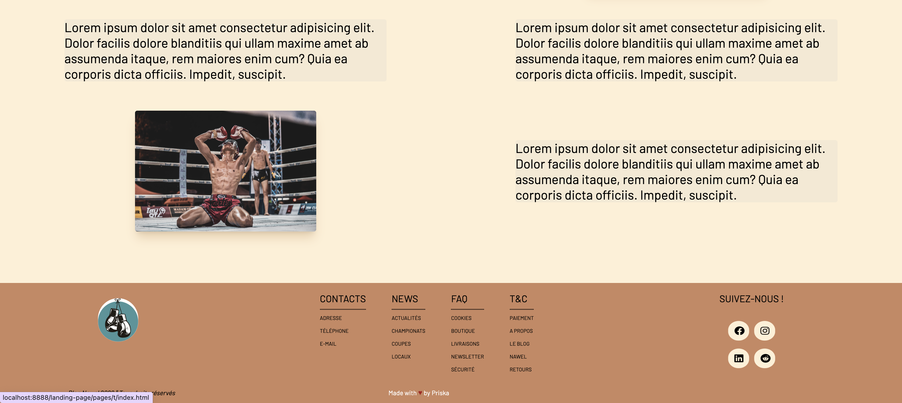

# OnlineFormaPro - ACS 2022 - Projet Intégration Wireframe

Dans ce projet d'intégration wireframe effectué par groupe de deux, nous avons appris à nous familiariser avec les languages HTML et CSS; découvrir les bonnes pratiques et conventions de développement; nous familiariser avec l'éditeur VS Code, les serveurs FTP, GitHub et le terminal BASH.

Pour commencer, nous avons à travers le terminal de VS Code, crée la base de notre projet :

- Créer un nouveau dossier sur notre workspace portant le nom de landing-page
- Ajouter un dossier Assets comprenant notre CSS et Img.
- Crée un index.html; .gitignore; README.md
- Envoyez le tout sur notre serveur distant via GitHub

## 📝 Etapes

Le travail a été séparé en deux

- Deux branches respectives ont été crées sur VS Code.
- Nawel s'est occupé du Header.
- Le body a été fait par Nawel et Priska
- Priska a effectué le footer.

> Une Charte graphique a également été utilisé afin de respecter l'interface graphique du projet.
 A la fin du projet, le README a été finalisé
 Merge effectué sur la branche main via le terminal

- Mise en production effectué sur les logiciels **FileZilla** et **Cyberduck**

## CSS utilisés

Nous avons utilisé deux nouvelles fonctions afin de positionner et organiser nos élements :

- **Flexbox** 
- **Grid**

> Le framework **Tailwind** CSS a également été utilisé

## 📸 Screenshots

## 🔗 Liens

- [GitHub](https://github.com/NAWELC/landing-page.git)
- [Serveur public](https://priscad.promo-171.codeur.online/landing-page/)

## Contact

- Nawel Chaib 👩🏻‍💻 [GitHub/Nawel]()
- Priska Derville 👩🏾‍💻 [GitHub/Priska]()

## Ressources

- [Tailwind CSS](https://tailwindcss.com/)
- [Google](https://www.google.fr/)
- [Wireframe cc](https://wireframe.cc/)
- [Pexels](https://www.pexels.com/fr-fr/)
- [GitHub](https://github.com/)
- [Font Awesome](https://fontawesome.com/)
- [Google Fonts](https://fonts.google.com/)
- [Mdn](https://developer.mozilla.org/fr/)
- [W3 schools](https://www.w3schools.com/)
- [Stack Overflow](https://stackoverflow.com/)
- [Flexbox froggy](https://flexboxfroggy.com/)
- [Codepip/ Grid Garden](https://codepip.com/games/grid-garden/)

# EN VERSION - OnlineFormaPro - ACS 2022 - Wireframe Intregration Project

In this wireframe integration project done in groups of two, we learned to familiarize ourselves with the HTML and CSS languages; to discover the good practices and conventions of development; to familiarize with the VS Code editor, the FTP servers, GitHub and the BASH terminal.

To start, we created the base of our project through the VS Code terminal:

- Created a new folder on our workspace with the name landing-page
- Add an Assets folder with our CSS and Img.
- Created an index.html; .gitignore; README.md
- Upload it to our remote server via GitHub

## 📝 Steps

The work was split into two

- Two respective branches were created on VS Code.
- Nawel took care of the header.
- The body was done by Nawel and Priska
- Priska took care of the footer.

> A graphic charter was also used to respect the graphic interface of the project.
 At the end of the project, the README was finalized
 Merge done on the main branch via the terminal

- Put on production with the **FileZilla** and **Cyberduck** softwares

## CSS used

We used two new functions to position and organize our elements:

- **Flexbox** 
- **Grid**

> The **Tailwind** CSS framework was also used

## 📸 Screenshots

## 🔗 Liens

- [GitHub](https://github.com/NAWELC/landing-page.git)
- [Serveur public](https://priscad.promo-171.codeur.online/landing-page/)

## Contact

- Nawel Chaib 👩🏻‍💻 [GitHub/Nawel]()
- Priska Derville 👩🏾‍💻 [GitHub/Priska]()

## Ressources

- [Tailwind CSS](https://tailwindcss.com/)
- [Google](https://www.google.fr/)
- [Wireframe cc](https://wireframe.cc/)
- [Pexels](https://www.pexels.com/fr-fr/)
- [GitHub](https://github.com/)
- [Font Awesome](https://fontawesome.com/)
- [Google Fonts](https://fonts.google.com/)
- [Mdn](https://developer.mozilla.org/fr/)
- [W3 schools](https://www.w3schools.com/)
- [Stack Overflow](https://stackoverflow.com/)
- [Flexbox froggy](https://flexboxfroggy.com/)
- [Codepip/ Grid Garden](https://codepip.com/games/grid-garden/)